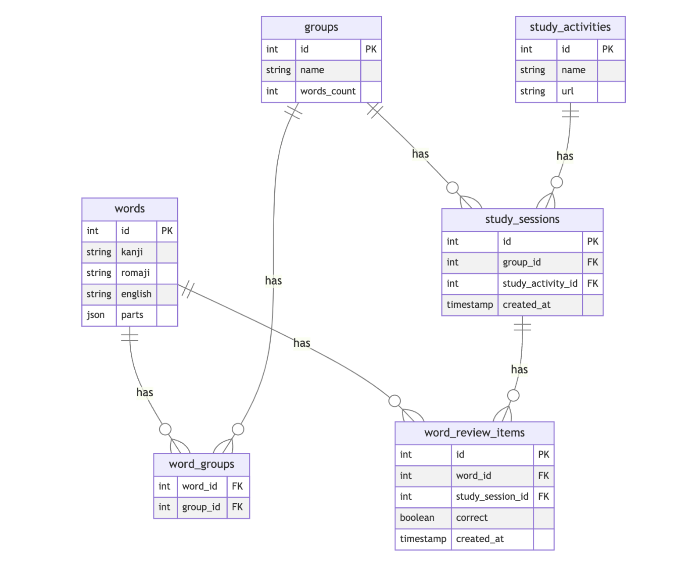

# Backend Server Technical Sepcs

## Business Goal:

A language learning school wants to build a prototype of learning portal which will act as three things:
- Inventory of possible vocabulary that can be learned
- Act as a  Learning record store (LRS), providing correct and wrong score on practice vocabulary
- A unified launchpad to launch different learning apps

## Technical Requirements
- The backend will be built using Python
- The backend will be organized in a clean architecture
- The database will be SQLite3
- The database will be manage with alembic
- The API will be described using OpenAPI
- The API will be built using FastAPI
- The API will be in RESTful format and return JSON
- There will no authentication or authorization
- Everything be treated as a single user

## Persistence
Our database will be a single SQLite3 database called `lang-portal.db`.

### Database Schema


#### Tables
**words** — Stores individual Japanese vocabulary words.
- `id` (Primary Key): Unique identifier for each word
- `kanji` (String, Required): The word written in Japanese kanji
- `romaji` (String, Required): Romanized version of the word
- `english` (String, Required): English translation of the word
- `parts` (JSON, Required): Word components stored in JSON format

**groups** — Manages collections of words.
- `id` (Primary Key): Unique identifier for each group
- `name` (String, Required): Name of the group
- `words_count` (Integer, Default: 0): Counter cache for the number of words in the group

**word_groups** — join-table enabling many-to-many relationship between words and groups.
- `word_id` (Foreign Key): References words.id
- `group_id` (Foreign Key): References groups.id

**study_activities** — Defines different types of study activities available.
- `id` (Primary Key): Unique identifier for each activity
- `name` (String, Required): Name of the activity (e.g., "Flashcards", "Quiz")
- `url` (String, Required): The full URL of the study activity

**study_sessions** — Records individual study sessions.
- `id` (Primary Key): Unique identifier for each session
- `group_id` (Foreign Key): References groups.id
- `study_activity_id` (Foreign Key): References study_activities.id
- `created_at` (Timestamp, Default: Current Time): When the session was created

**word_review_items** — Tracks individual word reviews within study sessions.
- `id` (Primary Key): Unique identifier for each review
- `word_id` (Foreign Key): References words.id
- `study_session_id` (Foreign Key): References study_sessions.id
- `correct` (Boolean, Required): Whether the answer was correct
- `created_at` (Timestamp, Default: Current Time): When the review occurred

#### Relationships
- word belongs to groups through word_groups
- group belongs to words through word_groups
- session belongs to a group
- session belongs to a study_activity
- session has many word_review_items
- word_review_item belongs to a study_session
- word_review_item belongs to a word

#### Design Notes
- All tables use auto-incrementing primary keys
- Timestamps are automatically set on creation where applicable
- Foreign key constraints maintain referential integrity
- JSON storage for word parts allows flexible component storage
- Counter cache on groups.words_count optimizes word counting queries

### Database Initialization
The database will be initialized as a SQLite3 database called `lang-portal.db`.


## API 
The API endpoints are defined in the file [backend-contract.yaml](./backend-contract.yaml) and can be visualized using the [Swagger Editor](https://editor-next.swagger.io/).

## Development Environment Setup

### Prerequisites
- Python 3.11 or higher
- uv package manager (faster alternative to pip)

### Installation Steps

1. Install uv:
```bash
curl -LsSf https://astral.sh/uv/install.sh | sh
```
After installation, you need to restart your terminal:
```bash
export PATH="$HOME/.cargo/bin:$PATH"
```
note: with WSL, the installation was not done in the home directory. You have to check the installation path and add it to the PATH.

2. Create and activate a virtual environment:
```bash
uv venv
source .venv/bin/activate  # On Unix/MacOS
# OR
.venv\Scripts\activate     # On Windows
```

3. Install dependencies:
```bash
uv pip install fastapi sqlalchemy
```

4. Start the development server:
```bash
uvicorn main:app --reload
```

The API will be available at http://localhost:8000
The API documentation will be available at http://localhost:8000/docs
